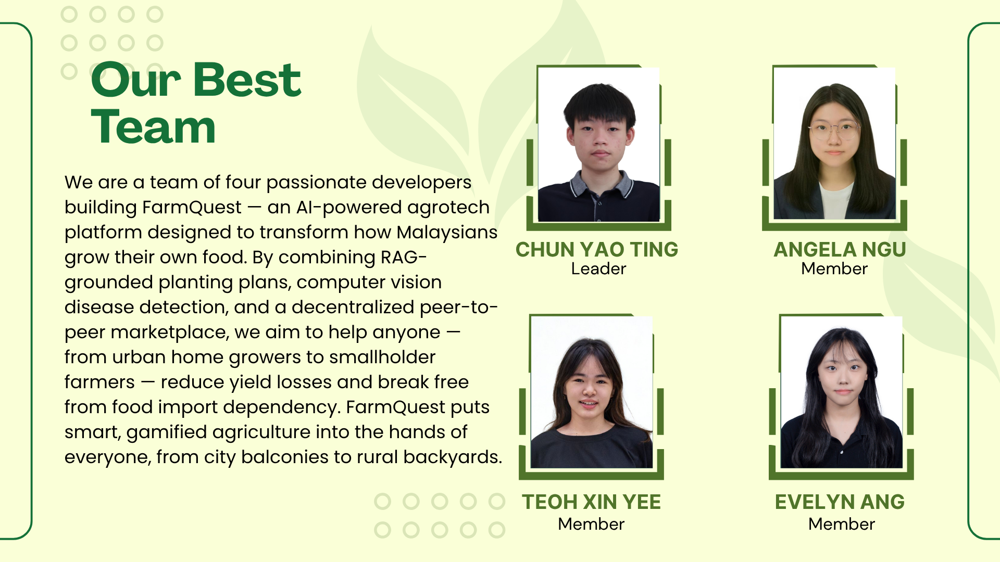
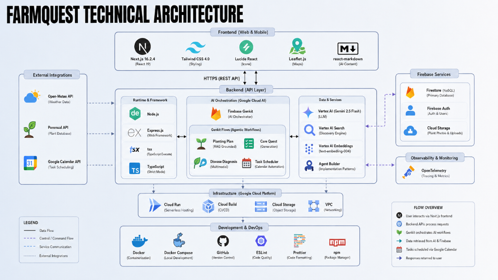

# 🌱 FarmQuest - AI-Powering Every Harvest

**Plan. Plant. Prosper.**

*   **Track:** Track 1: Padi & Plates (Agrotech & Food Security)
*   **Goal:** Advancing the Nation by Building Solutions with Google AI
*   **Live Demo:** 🚀 [View Application](https://farmquest-frontend-429572655157.us-central1.run.app/)

#### 🎯 Target SDGs
*   🌾 **Goal 2:** Zero Hunger
*   🏗️ **Goal 9:** Industry, Innovation, & Infrastructure
*   ♻️ **Goal 12:** Responsible Consumption & Production

---
## 👥 The Team: FarmQuest Pioneers

We are a team of four passionate developers building FarmQuest — an AI-powered agrotech platform designed to transform how Malaysians grow their own food. By combining RAG-grounded planting plans, computer vision disease detection, and a decentralized peer-to-peer marketplace, we aim to help anyone — from urban home growers to smallholder farmers — reduce yield losses and break free from food import dependency. FarmQuest puts smart, gamified agriculture into the hands of everyone, from city balconies to rural backyards.


| Name | Role | Responsibilities |
| :--- | :--- | :--- |
| **Chun Yao Ting** | Team Lead & AI Architect | Overall system architecture, AI orchestration (Genkit), and Gemini/Vertex AI integration. |
| **Angela Ngu Xin Yi** | Frontend Engineer | Next.js 16 dashboard development, UI/UX design (Tailwind v4), and responsive user experience. |
| **Evelyn Ang** | Backend & Cloud Lead | Express.js API development, Firebase services (Firestore/Auth), and GCP infrastructure. |
| **Teoh Xin Yee** | AI Data Specialist | RAG grounding strategies, Vertex AI Search optimization, and botanical data management. |

---
## 🔎 Project Overview

### 🚩 The Challenge: The National Food Security Gap
Malaysia currently faces a multi-billion ringgit food security crisis, making the nation vulnerable to global supply chain disruptions and currency fluctuations.

*   **Import Dependency:** Malaysia imported **RM75.6 Billion** worth of food (2022), creating a heavy reliance on foreign sources.
*   **The Yield Loss Crisis:** Up to **30-40% of crops** are lost to undetected pathologies and pests due to a lack of precision guidance.
*   **Resource Inefficiency:** Traditional methods suffer from data gaps, leading to wasted water, fertilizer, and capital.
*   **Technological Gap:** Modern agrotech is often too expensive or complex for local smallholders and urban citizens to adopt.

### 🌍 SDG Alignment
*   **SDG 2: Zero Hunger** — Increasing agricultural productivity and ensuring sustainable food production systems.
*   **SDG 9: Industry, Innovation, & Infrastructure** — Integrating AI, RAG, and Drone technology into traditional farming.
*   **SDG 12: Responsible Consumption & Production** — Precision farming that minimizes resource waste.

### 💡 The Solution: AI-Driven Decentralized Agriculture
FarmQuest is a **hybrid decentralized agrotech platform** that democratizes smart farming by putting expert agricultural intelligence into the hands of every home grower and smallholder:

*   **Demand-First Farming:** A marketplace where users plant because demand exists, matching local supply with real-time community needs.
*   **RAG-Grounded Guidance:** Personalized, step-by-step planting plans powered by Gemini 2.5 Flash and Vertex AI Search, tailored to local weather and user budget.
*   **AI Plant Doctor:** Instant image-based diagnosis of crop diseases with step-by-step recovery timelines.
*   **Technological Sovereignty:** Empowering citizens to contribute to national output and buffer against global supply shocks.


---

## 🏗️ Technical Architecture



FarmQuest is built on a modern, AI-first stack powered by **Google Cloud Platform** and **Firebase**. The architecture is organized into five specialized layers:

*   **Unified Frontend**: A high-performance **Next.js 15** and **React 19** interface with **Tailwind CSS 4** for a seamless experience.
*   **AI Orchestration Layer**: Powered by **Firebase Genkit**, managing workflows for RAG-grounded planting plans and multi-modal disease diagnosis.
*   **Intelligent Data & Services**: Leverages **Vertex AI** (Gemini 2.5 Flash) and **Vertex AI Embeddings (text-embedding-004)** for localized, economically viable recommendations.
*   **Scalable Infrastructure**: A robust serverless backend using **Cloud Run** and **Firebase Services** (Firestore, Auth, Storage) for real-time data and high availability.
*   **External Integrations**: Connections to **Open-Meteo** (weather), **Perenual** (botanical data), and **Google Calendar** (automated task scheduling).

---

## 🌟 Key Features & AI Integration

FarmQuest leverages the **Google AI Ecosystem Stack** to power its logic and autonomy:

- **AI Plant Health Doctor (Gemini 2.5 Flash)**: An image-based diagnostic tool that instantly identifies crop diseases and provides step-by-step recovery timelines.
- **Precision RAG Marketplace**: A peer-to-peer trading hub. FarmQuest uses a custom Retrieval-Augmented Generation (RAG) system powered by **Vertex AI Embeddings (text-embedding-004)** to "read" local plant databases and price indices. The AI suggests fair market prices and local plant alternatives based on vector similarity.
- **Grounded Planting Plans**: High-precision planting schedules for soil, nutrition, and seed management. Plans are generated in *Budget*, *Balanced*, and *Premium* tiers, tailored to the farmer's specific budget and environmental conditions (via Open-Meteo GPS data).
- **Gamified Farmer Quests & Google Calendar Sync**: FarmQuest acts as an autonomous agent, turning best practices into actionable quests and pushing "Care Calendar" tasks directly into the user's Google Calendar.

---

## 📈 System Scalability & Feasibility

### 🚀 System Scalability
FarmQuest is designed to grow from a local community tool to a national agrotech infrastructure:
- **Serverless Scaling**: By leveraging **Google Cloud Run** and **Firebase Functions**, the backend scales horizontally in seconds, handling surges in marketplace traffic or seasonal planting spikes without manual intervention.
- **High-Throughput AI**: The use of **Gemini 2.5 Flash** ensures that multi-modal plant diagnosis and RAG-driven market analysis remain low-latency even with thousands of concurrent users.
- **Distributed Marketplace**: Firestore’s real-time, globally distributed database architecture supports a high volume of peer-to-peer transactions across various geographical regions.
- **Extensible Agentic Workflows**: The **Genkit** orchestration layer allows for the seamless addition of new tools (e.g., IoT soil sensors, drone fleet management) as the platform evolves.

### 💡 System Feasibility
The platform is technically and economically viable for immediate deployment:
- **Cost-Optimized AI**: Utilizing Gemini Flash and tiered planting plans ensures that even the most "Budget" conscious home growers can access high-quality agricultural intelligence without expensive hardware.
- **Low Operational Overhead**: The cloud-native, serverless approach minimizes maintenance costs, allowing the platform to remain sustainable under the freemium and C2C commission models.
- **Low Barrier to Entry**: By gamifying complex agricultural routines into "Quests," FarmQuest makes smart farming feasible for users with zero prior experience or technical literacy.
- **Alignment with National Policy**: Directly supports Malaysia's **MyDIGITAL** and **NIMP 2030** goals, making it a high-priority candidate for government and industry partnerships.

---

## 🏢 Business Model

FarmQuest targets the market gap of **demand-first farming** and **decentralized participation** through a comprehensive four-pillar business model:

1. **C2C (Consumer-to-Consumer)**: A small 3–5% transaction fee on the Peer-to-Peer Marketplace where users trade seeds, plants, and produce.
2. **B2C (Business-to-Consumer)**: A freemium subscription model. Basic features are free, while premium users get advanced insights, predictive analytics, and enhanced AI guidance.
3. **B2B (Business-to-Business)**: Partnerships with seed suppliers, fertilizer companies, and agri-tech providers. Revenue via product sales commissions and service fees.
4. **B2G (Business-to-Government)**: Providing national crop data, demand trends, and food supply analytics to support policy-making and national food security planning.

### 🎯 Market Segments
FarmQuest is engineered to serve a diverse agricultural ecosystem:
- **SME Urban Farms**: (Restaurants & Food Tech Companies). FarmQuest’s harvest estimator gives small business owners a real-time **Days-to-Harvest countdown** with high confidence, preventing unnecessary adjustments that waste time, nutrients, and money.
- **Government**: (Agencies & Research Labs). Directly supports **MyDIGITAL** and **DAN 2.0** by providing a "Ready-to-Deploy" framework for precision agriculture. Tracking of yield trends and resource usage helps to keep operational costs low and national food security high.
- **Academic**: (Universities & Campus Greenhouses). Uses explainable AI and transparent growth tracking, allowing researchers to study environmental trends. **Health score analytics** provide a quantifiable metric for how variables (soil quality, water, climate) impact growth rates, perfect for academic study.

---

## 🌍 Social Impact & Sustainability

### 🤝 Social Impact
FarmQuest aims to foster a resilient and self-sustaining community:
- **Hyper-Local Food Security**: Empowers communities to grow fresh produce directly in urban centers, reducing dependence on long supply chains and global price shocks.
- **Education & Digital Literacy**: Creates opportunities for "urban agritech" roles and serves as an educational tool for schools and universities to explore AI-driven agriculture.
- **Community Health**: Increases access to nutrient-rich, locally-grown food and encourages active, healthy habits through its gamified quest system.
- **Inclusive Participation**: Our decentralized model ensures that anyone—from balcony hobbyists to small-scale growers—can contribute to national food sovereignty.

### 🍃 Sustainability
Our platform integrates environmental stewardship into every "Quest":
- **Water & Resource Conservation**: Precision AI-guided plans ensure that water and fertilizer are used only when necessary, minimizing resource waste and runoff.
- **Reduced Food Miles**: By promoting food production at the point of consumption, FarmQuest drastically cuts down transportation emissions and packaging waste.
- **Bio-Waste Reduction**: Real-time AI disease detection prevents total crop losses, ensuring that the energy and resources invested in every plant result in a successful harvest.
- **Energy-Efficient Guidance**: Optimized planting schedules maximize natural sunlight and environmental conditions, reducing the need for intensive artificial interventions.

## 🛠️ Setup Instructions

### Prerequisites
- Node.js v18.x or higher
- Google Cloud Platform (GCP) Account with Vertex AI enabled
- Firebase Project configuration

### 1. Installation

Clone the repository and install the necessary dependencies:

```bash
git clone https://github.com/yourusername/FarmQuest.git
cd FarmQuest
npm install
```

### 2. Environment Variables

Create a `.env.local` file in the root directory and add the necessary API keys and Firebase credentials:

```env
# Firebase Configuration
NEXT_PUBLIC_FIREBASE_API_KEY=your_api_key
NEXT_PUBLIC_FIREBASE_AUTH_DOMAIN=your_auth_domain
NEXT_PUBLIC_FIREBASE_PROJECT_ID=farmquest-86532
NEXT_PUBLIC_FIREBASE_STORAGE_BUCKET=your_storage_bucket
NEXT_PUBLIC_FIREBASE_MESSAGING_SENDER_ID=your_sender_id
NEXT_PUBLIC_FIREBASE_APP_ID=your_app_id

# Google Calendar API (OAuth)
GOOGLE_CLIENT_ID=your_google_client_id
GOOGLE_CLIENT_SECRET=your_google_client_secret

# Open-Meteo API endpoint (No Auth Required)
NEXT_PUBLIC_METEO_API_URL=https://api.open-meteo.com/v1/forecast

# Optional Vertex AI Search config for RAG grounding
GOOGLE_VERTEX_SEARCH_DATASTORE=your_datastore_id
GOOGLE_VERTEX_SEARCH_COLLECTION=default_collection
GOOGLE_VERTEX_SEARCH_SERVING_CONFIG=default_search
GOOGLE_VERTEX_SEARCH_LOCATION=global
```

### 3. Genkit Orchestration & Agentic Workflow
FarmQuest uses **Firebase Genkit** for its agentic backend to satisfy the project's agentic workflow criteria. This provides observability into AI sub-steps and tool execution.

**To run the Genkit-instrumented backend:**
1. Navigate to the server directory:
   ```bash
   cd server
   ```
2. Install dependencies (including `genkit-cli`):
   ```bash
   npm install
   ```
3. Start the server with Genkit tracing enabled:
   ```bash
   npm run genkit:dev
   ```
4. Open the **Genkit Developer UI** at `http://localhost:4001` to inspect flows, tools, and traces.

### 4. Local Development
To run the full application locally, you need two terminals running simultaneously:

**Terminal 1: Backend Server**
```bash
cd server
npm run dev
```

**Terminal 2: Frontend Interface**
```bash
# In the root directory
npm run dev
```

Navigate to `http://localhost:3000` to access the FarmQuest dashboard.

### Vertex AI Search import files

If you want to import FarmQuest data into Vertex AI Search, generate JSONL files with:

```bash
npm run reshape:vertex-search
```

This writes:

- `server/data/vertex-search/plants.jsonl`
- `server/data/vertex-search/prices.jsonl`

The files contain flattened, document-id-based records that are easier to import into a structured Vertex AI Search data store.

---

## 🚀 Deployment to Google Cloud Run

To satisfy the hackathon's technical mandate, FarmQuest is fully containerized and deployable via Google Cloud Run.

1. **Build the Docker Image**:
   ```bash
   gcloud builds submit --tag gcr.io/farmquest-86532/farmquest-app
   ```

2. **Deploy to Cloud Run**:
   ```bash
   gcloud run deploy farmquest-app \
     --image gcr.io/farmquest-86532/farmquest-app \
     --platform managed \
     --region asia-southeast1 \
     --allow-unauthenticated
   ```

---


## 🤝 Contribution & License

FarmQuest is developed for the **Project 2030: MyAI Future Hackathon**. We strongly adhere to the hackathon's Code of Conduct and encourage open-source innovation under ethical AI principles.

**"Advance the Nation by Building Solutions with Google AI"**
